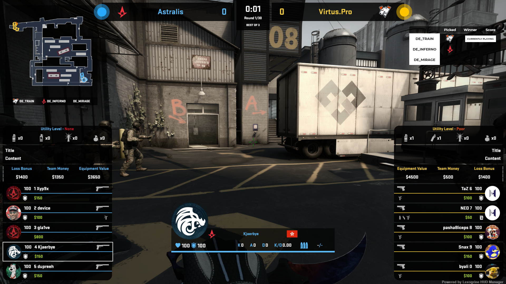

<p align="center">
	<p align="center" style="font-weight:600; letter-spacing:1pt; font-size:20pt;">LEXOGRINE HUD</p>
	<p align="center"></p>
	<p align="center" style="font-weight:400;">Powered by <a href='https://github.com/lexogrine/hud-manager'><strong>« Lexogrine HUD Manager »</strong></a></p>
</p>

# EGF Lexogrine HUD - Modified by LaggySon


  

Fullfledged example of the React HUD made for HUD Manager. It has:

- Custom actions
- Keybinds
- Killfeed
- Player cam feed
- Custom Radar

## Keybinds:
### **Left Alt + S**
>Makes radar smaller by 20px;
### **Left Alt + B**
>Makes radar bigger by 20px;
### **Left Alt + T**
>Shows trivia box
### **Left Alt + M**
>Toggles upcoming match box
### **Left Alt + P**
>Toggles player preview
### **Left Alt + C**
>Toggles camera feed
### **Left Ctrl + B**
>Make radar invisible

## **Panel**
## Trivia settings

|  Field|Description  |
|--|--|
|  Trivia title| `Text` |
|  Trivia content| `Text` |


## Display settings


|  Field|Description  |
|--|--|
|  Left/right box's title| `Text` |
|  Left/right box's title| `Text` |
|  Left/right box's image logo| `Image file` |

## Example settings


## Preview



# Download

To download it just click here: [DOWNLOAD HUD](https://github.com/lexogrine/csgo-react-hud/releases/latest)

# Instruction
## Setting up
Fork this repo, clone it, and then run `npm install` and `npm start`. HUD should start on the 3500 port. For this to work have HUD Manager opened so it will pass CS:GO data to the HUD.

## Identifying HUD
In `/public` directory edit hud.json so it fits you - fill HUD's name, author, version, specify the radar and killfeed functionalities. At the end replace the thumb.png with your icon :)

## Building & distributing
To build version to distribute and move around, in the root directory run `npm run pack`. It will create the zip file for distribution. Now you can just drag and drop this file into the HUD Managers upload area.

## Signing

To create Signed HUD to prevent at least from modyfing compiled Javascript files run `npm run sign`. It's the same as `npm run pack` command but with additional step of signing .js and .css files and hud.json.

  
 ## File structure
 The HUD is seperated into two parts - the API part, that connects to the HUD Manager API and communicate with it: `src/App.tsx` file and `src/api` directory. Usually, you don't want to play with it, so the whole runs without a problem.
 The second part is the render part - `src/HUD`, `src/fonts` and `src/assets` are the directories you want to modify. In the `src/HUD` each element of the HUD is seperated into its own folder. Styles are kept in the `src/HUD/styles`. Names are quite self-explanatory, and to modify style of the element you should just find  the styling by the file and class name.


## `panel.json` API
To get the incoming data from the HUD Manager, let's take a look at the `src/HUD/SideBoxes/SideBox.tsx` `componentDidMount()` method:
```javascript
import {configs} from  './../../App';
...
configs.onChange((data:any) => {
	if(!data) return;
	
	const  display = data.display_settings;
	
	if(!display) return;
	
	if(display[`${this.props.side}_title`]){
		this.setState({title:display[`${this.props.side}_title`]})
	}
	if(display[`${this.props.side}_subtitle`]){
		this.setState({subtitle:display[`${this.props.side}_subtitle`]})
	}
	if(display[`${this.props.side}_image`]){
		this.setState({image:display[`${this.props.side}_image`]})
	}
});
```
To retrieve incoming data, you should just import `configs` object and then listen for the changes with `onChange` method. Usually you want to check for the specific data, as in the callback it will always serve the full form from the Manager.
However it looks different in the case of action input. In this case, let's look at the `src/HUD/Trivia/Trivia.tsx`:
```javascript
import {configs, actions} from  './../../App';
...
actions.on("triviaState", (state: any) => {
	this.setState({show:  state === "show"})
});
```
For the action input we need to import the `actions` object and create listener with the parameter on it.
## `keybinds.json` API
Keybinds API works in very similiar to `panel.json` action API. One more time the example will be from `src/HUD/Trivia/Trivia.tsx`:
```javascript
import {configs, actions} from  './../../App';
...
actions.on("toggleTrivia", () => {
	this.setState({show: !this.state.show})
});
```
Keybinds listener works on the same object as action input, in this case however there are no parameter to retrieve.

## Killfeed
Because our  `csgogsi` has the ability to process input from HLAE's MIRV, listening for kills is very easy. We can see than in `src/HUD/Killfeed/Killfeed.tsx`:
```javascript
componentDidMount() {
	GSI.on("kill", kill  => {
		this.addKill(kill);
	});
}
```
The Killfeed component basically just keeps kills in the state during the round, and after the round it cleans the state. Kills have CSS animation, that makes them gently show, and after a few seconds disappear, the experience is very smooth. You can fiddle with the styling in the `killfeed.css`
This killfeed detects who killed whom, if there was an assist (flash assist as well), used weapon, headshot and wallbang.

## Radar
Radar is custom React-based component, made by Hubert Walczak, and is easily editable from css.
